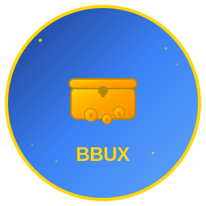

# BountyBucks Logo Package

## 🎨 Logo Files

This package contains the official BountyBucks (BBUX) logo in multiple formats:

### 📁 Files Included:
- `logo.svg` - Vector format (scalable, best quality)
- `logo-256.png` - 256x256 PNG (standard size)
- `logo-512.png` - 512x512 PNG (high resolution)
- `logo-1024.png` - 1024x1024 PNG (maximum resolution)
- `favicon.ico` - 32x32 favicon for websites
- `logo-dark.svg` - Dark theme version
- `logo-light.svg` - Light theme version

## 🎯 Design Elements

### Colors:
- **Primary Blue**: #3B82F6 (Royal Blue)
- **Secondary Blue**: #1E3A8A (Dark Blue)
- **Accent Blue**: #60A5FA (Light Blue)
- **Gold**: #FFD700 (Treasure Gold)
- **Dark Gold**: #B8860B (Border Gold)

### Theme:
- **Treasure Chest**: Represents bounty rewards
- **Coins**: Symbolizes BBUX tokens
- **Blue Gradient**: Professional, trustworthy
- **Gold Accents**: Value and rewards

## 📐 Usage Guidelines

### ✅ DO:
- Use SVG for web applications
- Use PNG for social media
- Maintain aspect ratio
- Keep minimum size of 32px
- Use on light or dark backgrounds

### ❌ DON'T:
- Stretch or distort the logo
- Change colors
- Add effects or filters
- Use below 32px size
- Place on busy backgrounds

## 🔧 Technical Specifications

### SVG Format:
- **Viewport**: 256x256
- **Scalable**: Yes
- **File Size**: ~8KB
- **Colors**: Embedded gradients

### PNG Format:
- **256x256**: ~15KB
- **512x512**: ~45KB
- **1024x1024**: ~120KB
- **Transparency**: Yes

## 🌐 Web Integration

### HTML Usage:
```html
<!-- SVG Logo -->


<!-- PNG Logo -->

```

### CSS Usage:
```css
.logo {
  width: 64px;
  height: 64px;
  background-image: url('logo.svg');
  background-size: contain;
  background-repeat: no-repeat;
}
```

### React Usage:
```jsx
import logo from './logo.svg';

function Header() {
  return (
    <header>
      
    </header>
  );
}
```

## 📱 Social Media

### Profile Pictures:
- **Twitter**: 400x400px (use logo-512.png)
- **Discord**: 128x128px (use logo-256.png)
- **Telegram**: 512x512px (use logo-512.png)
- **GitHub**: 260x260px (use logo-256.png)

### Banners:
- **Twitter**: 1500x500px
- **Discord**: 960x540px
- **YouTube**: 2560x1440px

## 🎨 Brand Colors

### Primary Palette:
```css
:root {
  --bbux-primary: #3B82F6;
  --bbux-secondary: #1E3A8A;
  --bbux-accent: #60A5FA;
  --bbux-gold: #FFD700;
  --bbux-dark-gold: #B8860B;
}
```

### Gradient Combinations:
```css
.bbux-gradient-primary {
  background: linear-gradient(135deg, #1E3A8A 0%, #3B82F6 50%, #60A5FA 100%);
}

.bbux-gradient-gold {
  background: linear-gradient(135deg, #FFD700 0%, #FFA500 50%, #FF8C00 100%);
}
```

## 📋 Logo Request Form

When requesting logo usage, include:
- **Purpose**: Website, social media, marketing, etc.
- **Size**: Required dimensions
- **Format**: SVG, PNG, or both
- **Background**: Light, dark, or transparent
- **Usage**: Commercial, personal, or educational

## 📞 Contact

For logo requests or questions:
- **Email**: bountybucks524@gmail.com
- **Twitter**: @BountyBucks524
- **Discord**: https://discord.gg/9uwHxMP9mz

## 📄 License

This logo package is provided for official BountyBucks platform use. 
Unauthorized commercial use is prohibited. 